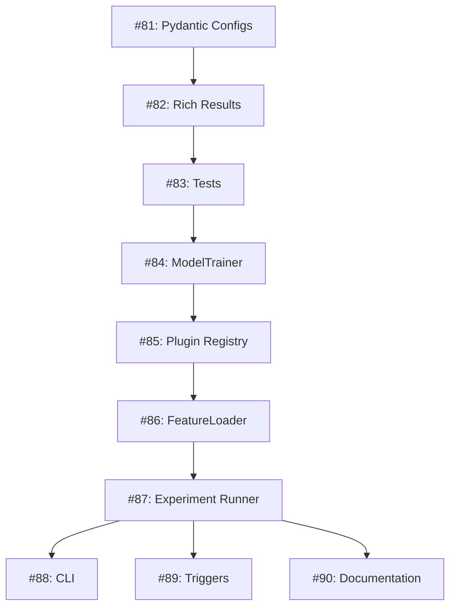

# GitHub Project Board Guide - Framework Implementation

**Epic**: Issue #80 - Extensible MLB Prediction Framework  
**Total Issues**: 11 (1 Epic + 10 Phase Issues)  
**Total Hours**: 22 hours  
**Created**: April 24, 2026

---

## GitHub Issues Overview

### Epic Issue
- **#80** - [Extensible MLB Prediction Framework](https://github.com/cbwinslow/retrosheet/issues/80)
  - Main tracking issue with deployment plan
  - Links to all 10 phase issues
  - Contains documentation references

### Phase 1: Foundation (Week 1) - 6 hours
| Issue | Title | Hours | Status |
|-------|-------|-------|--------|
| **#81** | [Phase 1.1] Pydantic Configuration Schemas | 2 | 🔵 Open |
| **#82** | [Phase 1.2] Rich Result Classes | 3 | 🔵 Open |
| **#83** | [Phase 1.3] Test Infrastructure | 1 | 🔵 Open |

### Phase 2: Core Wrappers (Week 2) - 10 hours
| Issue | Title | Hours | Status |
|-------|-------|-------|--------|
| **#84** | [Phase 2.1] ModelTrainer Class | 4 | 🔵 Open |
| **#85** | [Phase 2.2] Plugin Registry | 2 | 🔵 Open |
| **#86** | [Phase 2.3] FeatureLoader | 2 | 🔵 Open |
| **#87** | [Phase 2.4] Experiment Runner | 2 | 🔵 Open |

### Phase 3: Polish (Week 3) - 6 hours
| Issue | Title | Hours | Status |
|-------|-------|-------|--------|
| **#88** | [Phase 3.1] Unified CLI | 2 | 🔵 Open |
| **#89** | [Phase 3.2] Database Triggers | 1 | 🔵 Open |
| **#90** | [Phase 3.3] Documentation | 2 | 🔵 Open |

---

## Recommended GitHub Project Board Setup

### Create New Project
1. Go to repo → Projects → New Project
2. Name: "Framework Implementation - Issue #80"
3. Template: "Board" (Kanban style)
4. Link to issue #80

### Board Columns

```
┌─────────────┬───────────────┬───────────┬──────────┐
│   Backlog   │ In Progress   │  Review   │   Done   │
├─────────────┼───────────────┼───────────┼──────────┤
│ Issue #81   │               │           │          │
│ Issue #82   │               │           │          │
│ Issue #83   │               │           │          │
│ Issue #84   │               │           │          │
│ Issue #85   │               │           │          │
│ Issue #86   │               │           │          │
│ Issue #87   │               │           │          │
│ Issue #88   │               │           │          │
│ Issue #89   │               │           │          │
│ Issue #90   │               │           │          │
└─────────────┴───────────────┴───────────┴──────────┘
```

### Labels to Create

| Label | Color | Description |
|-------|-------|-------------|
| `phase-1` | #FEF2C0 | Foundation phase issues |
| `phase-2` | #C2E0C6 | Core wrappers phase issues |
| `phase-3` | #BFD4F2 | Polish phase issues |
| `framework` | #D4C5F9 | Framework implementation |
| `pydantic` | #F9D0C4 | Pydantic/config related |
| `high-priority` | #FF7619 | Critical path items |
| `blocked` | #E11D21 | Waiting on dependencies |

### Milestones to Create

| Milestone | Due Date | Issues |
|-----------|----------|--------|
| Phase 1 Complete | Week 1 end | #81, #82, #83 |
| Phase 2 Complete | Week 2 end | #84, #85, #86, #87 |
| Phase 3 Complete | Week 3 end | #88, #89, #90 |
| Framework Complete | Week 3 end | All #81-#90 |

---

## Workflow for Implementing Each Issue

### 1. Before Starting
```
- Read docs/DEPLOYMENT_PLAN.md for phase details
- Read docs/EXTENSIBLE_FRAMEWORK_DESIGN.md for architecture
- Check PROJECT_LOG.md for current status
- Verify previous phase issues are Done
```

### 2. Move to In Progress
```
- Move issue from Backlog → In Progress
- Assign yourself to issue
- Add comment: "Starting implementation"
- Reference implementation details from DEPLOYMENT_PLAN.md
```

### 3. Implementation
```
- Create feature branch: git checkout -b feature/issue-81-pydantic-configs
- Implement following DEPLOYMENT_PLAN.md specifications
- Write tests (see test requirements in issue)
- Run tests: pytest tests/test_*.py -v
```

### 4. Move to Review
```
- Move issue from In Progress → Review
- Create Pull Request
- Link PR to issue (Fixes #81)
- Add description of changes
- Request review (if applicable)
```

### 5. Merge & Complete
```
- Address any review feedback
- Merge PR to main
- Move issue from Review → Done
- Close issue
- Update PROJECT_LOG.md with completion
```

---

## Issue Dependencies



**Critical Path**: #81 → #82 → #83 → #84 → #85 → #86 → #87  
**Parallel Work**: #88, #89, #90 can start after #84

---

## Daily Standup Template (Add as Comment to #80)

```markdown
## Daily Standup - [Date]

### Yesterday
- Completed: [Issue numbers and brief description]
- Blockers: [Any blockers encountered]

### Today
- Working on: [Issue number and task]
- Expected completion: [Time estimate]

### Blockers
- [ ] None / [Describe blocker and who can help]

### Progress
- Phase 1: [X/3] complete
- Phase 2: [X/4] complete  
- Phase 3: [X/3] complete
- Total: [X/10] issues done ([X%])
```

---

## Weekly Review Template

```markdown
## Week [N] Review

### Issues Completed This Week
- [ ] #[issue] - [title]
- [ ] #[issue] - [title]

### Hours Logged This Week
- Actual: [N] hours
- Planned: [N] hours
- Variance: [+/-N] hours

### Next Week Plan
- Issues to complete: #[issue], #[issue]
- Hours estimate: [N] hours
- Risks/Blockers: [none or describe]

### Documentation Updates
- [ ] Updated docs/PROJECT_LOG.md
- [ ] Updated FILE_INVENTORY.md
- [ ] Created/updated docs as needed

### Tests Status
- [ ] Unit tests passing: [X/Y]
- [ ] Integration tests passing: [X/Y]
- [ ] E2E tests passing: [X/Y]
```

---

## Automation Suggestions

### GitHub Actions to Add

1. **Auto-label new issues**:
```yaml
- Add `phase-1` to #81-83
- Add `phase-2` to #84-87
- Add `phase-3` to #88-90
```

2. **PR Templates**:
```markdown
## Related Issue
Fixes #[issue number]

## Phase
- [ ] Phase 1: Foundation
- [ ] Phase 2: Core Wrappers
- [ ] Phase 3: Polish

## Checklist
- [ ] Tests added
- [ ] Tests passing
- [ ] Documentation updated
- [ ] PROJECT_LOG.md updated
```

3. **Issue Templates**:
```markdown
## Phase
- [ ] Phase 1
- [ ] Phase 2
- [ ] Phase 3

## Estimated Hours
[N] hours

## Implementation Details
See docs/DEPLOYMENT_PLAN.md

## Definition of Done
- [ ] Code implemented
- [ ] Tests passing
- [ ] Documentation updated
- [ ] PROJECT_LOG.md updated
```

---

## Tracking Progress

### Visual Progress Bar

Add to issue #80:

```
## Progress

Phase 1: Foundation
- [ ] #81 Pydantic Configs (2 hrs) ⬜ 0%
- [ ] #82 Rich Results (3 hrs) ⬜ 0%
- [ ] #83 Tests (1 hrs) ⬜ 0%

Phase 2: Core Wrappers  
- [ ] #84 ModelTrainer (4 hrs) ⬜ 0%
- [ ] #85 Plugin Registry (2 hrs) ⬜ 0%
- [ ] #86 FeatureLoader (2 hrs) ⬜ 0%
- [ ] #87 Experiment Runner (2 hrs) ⬜ 0%

Phase 3: Polish
- [ ] #88 CLI (2 hrs) ⬜ 0%
- [ ] #89 Triggers (1 hrs) ⬜ 0%
- [ ] #90 Documentation (2 hrs) ⬜ 0%

**Total**: ⬜ 0/22 hours (0%)
```

### Burndown Chart Data

Track weekly:
| Week | Planned Hours | Actual Hours | Issues Complete | % Complete |
|------|---------------|--------------|-----------------|------------|
| 1 | 6 | TBD | 0/3 | 0% |
| 2 | 10 | TBD | 0/4 | 0% |
| 3 | 6 | TBD | 0/3 | 0% |
| **Total** | **22** | TBD | **0/10** | **0%** |

---

## Communication Guidelines

### When to Comment on Issues
- **Starting work**: "Beginning implementation"
- **Progress update**: "50% complete, tests passing"
- **Blocker found**: "Blocked by [reason], need help with [specific]"
- **Ready for review**: "PR #[number] ready for review"
- **Complete**: "Merged! Closing issue"

### When to Update Epic (#80)
- Daily: Brief progress summary
- Weekly: Full weekly review
- Milestone: Phase completion celebration
- Blocker: Any major blockers affecting timeline

### When to Update PROJECT_LOG.md
- After completing each issue
- After discovering any architecture changes
- After any significant decisions
- Weekly regardless of progress

---

## Success Metrics

### GitHub Metrics to Track
- [ ] Issues closed: 0/10
- [ ] Pull requests merged: 0/10
- [ ] Test coverage: TBD%
- [ ] Documentation pages: 0/3 new
- [ ] Commits to main: TBD

### Quality Gates
- [ ] All Phase 1 tests passing before starting Phase 2
- [ ] All Phase 2 tests passing before starting Phase 3
- [ ] 100% test pass rate at completion
- [ ] All documentation complete
- [ ] PROJECT_LOG.md current

---

## Handoff Checklist (If Agent Changes)

If a new agent takes over:

- [ ] Read this GITHUB_PROJECT_GUIDE.md
- [ ] Read docs/DEPLOYMENT_PLAN.md
- [ ] Check issue #80 for current status
- [ ] Review PROJECT_LOG.md for progress
- [ ] Check GitHub Project board
- [ ] Verify which issue is In Progress
- [ ] Review any open PRs
- [ ] Check for blockers or questions

**Add comment to #80**: "Agent handoff - [New agent] taking over from [Old agent] on [Date]"

---

## Quick Links

| Resource | URL |
|----------|-----|
| Epic Issue | https://github.com/cbwinslow/retrosheet/issues/80 |
| All Issues | https://github.com/cbwinslow/retrosheet/issues?q=is%3Aopen+is%3Aissue+label%3Aframework |
| Deployment Plan | docs/DEPLOYMENT_PLAN.md |
| Framework Design | docs/EXTENSIBLE_FRAMEWORK_DESIGN.md |
| Project Log | docs/PROJECT_LOG.md |

---

**End of GitHub Project Guide**

This guide ensures maximum utility from GitHub's project management features. Every issue is tracked, dependencies are clear, and progress is visible.
